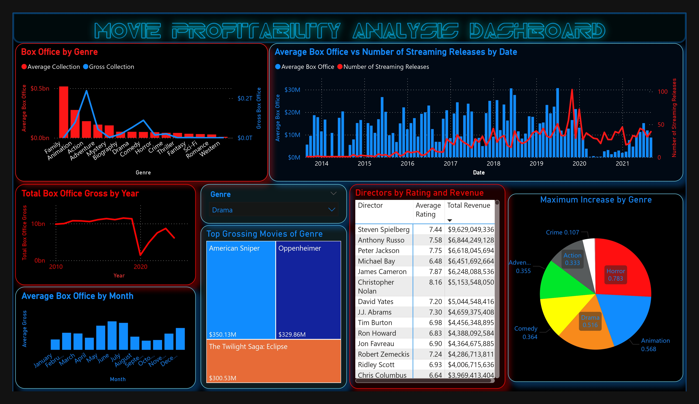

# Movie Profitability Analysis

---

---

## Skills Used:

[Excel](./Original_Datasets/movie_box_office.xlsx) - Web scraping, Data collection and Transformations.   
[Python](./EDA_and_Data_Preprocessing.ipynb) - EDA and Data Processing.   
[SQL](./Movie_Analysis_Queries.sql) - Data Quering in MS SQL Server Database.   
[Power BI](Movie_Profitability_Analysis_Report.pbix) - Visualizations and Reporting Dashboard.   

---

## Questions to Answer/Analyze:

    1. What are the highest grossing movies of 2024?
    2. What are the movies with highest ROI?
         - Indie movies with highest returns.
    3. Which genre movies are likely to collect more at the box office?
         - Visualization of Box office collections vs genres.
    4. Is Cinema dying?
         - Visualization of Box Office collections vs time (years).
    5. Is Streaming killing Cinema?
         - Vizualization and analysis of Netflix (streaming) releases vs box office collections.
    6. Which directors and actors were associated with the highest-grossing movies of 2024?
         - Matrix/Table of highest grossing Directors and Actors.
    7. How did movie releases during different seasons in 2024 affect box office performance?
         - Analysis of Box office trends yearly, seasonally, and monthly.
    8. What are the top 3 highest-grossing movies in each genre?
    9. Which directors are successful critically and commercially?
         - Total box office revenue and average rating for each director.
    10. What are the genres that have the highest increase in average rating over the past 5 years?

---

## Methodology:

### I. Data Collection:
Scraped data of 15 years of Movie box office collections from Excel.   

And Appended (Merged) all the years' box office data.   
Transformed the merged data by correcting data formats of the columns and removing dupicate rows, header, footer rows, and null values. (Cleaning the data.)   
Similarly cleaned Movie Dataset and the rest of the datasets.

### II. Data Preprocessing:
Performed Exploratory Data Analysis on the datasets using Python, pandas.   
[Python Notebook](./EDA_and_Data_Preprocessing.ipynb)

### III. Loading the Data into SQL Server:
Loaded the datasets on to the SQL Server.

### IV. Quering the Data to answer the Analysis Questions:
Queried the required data from the SQL Server tables using SQL queries.   
Let's say it is an [SQL File](./Movie_Analysis_Queries.sql').

### V. Visualization with Power BI:
Imported the data from SQL Server to Power BI using SQL Queries.   
Transformed the data columns in different tables using Power Query Editor.   
Added relationships between tables for an interactive dashboard report.   

Answered the questions raised using analysis dashboard from Power BI.

---

## Results from the Analysis:

### 1. What are the highest grossing movies in 2024?

A. of 2024    
B. Of All Time   

### 2. What are the movies with highest ROI?
####  - Indie movies with highest returns.   

### 3. Which genre movies are likely to collect more at the box office?
####  - Visualization of Box office collections vs genres.    

From the visualization, it is apparent that a **family** movie might result in a consistent average higher box office collection.   
But since more **action** movies are being released, action movies tend to have an overall higher gross box office revenue.

### 4. Is Cinema dying?
####  - Visualization of Box Office collections vs time (years).    

From the Power BI visulization, the box office collections have been steady until 2020. This is apparently due to the **COVID-19** pandemic, where the movie industry weakened for a while and box office numbers dropped.

### 5. Is Streaming killing Cinema?
####  - Vizualization and analysis of Netflix (streaming) releases vs box office collections.   

From the visualization, there is no apparent correlation between the number of streaming releases and the gross box office numbers. Although, the effect can be seen after the release of the **COVID-19** pandemic, where due to the streaming releases, the **box office numbers are struggling to pick up**.

### 6. Which directors and actors were associated with the highest-grossing movies of 2024?
####  - Matrix/Table of highest grossing Directors and Actors.    

### 7. How did movie releases during different seasons in 2024 affect box office performance?
####  - Analysis of Box office trends yearly, seasonally, and monthly.

From the Power BI visualization, it is apparent that **highest** box office collections can be observed in the month of **June**. And **least** box office collections can be observed in the month of **September**, followed by January.

This trend is apparent every year, as shown in the linked visualizations. So, if you want your movie to collect more, chances are that you'll have more box office revenue if you release your movie during the **Summer** season.

### 8. What are the top 3 highest-grossing movies in each genre?

### 9. Which directors are successful critically and commercially?
####     - Total box office revenue and average rating for each director.

From the data, it is apparent that **Stanley Kubrick** is the most critically acclaimed director. And **Steven Spielberg** is the most commercially popular director.

### 10. What are the genres that have the highest increase in average rating over the past 5 years?

Over the past 10 years, the **Horror** Genre had the highest increase in average rating. This means that the movies in Horror genre have **gotten better over the past decade**.

---

## Dataset References:

1. [Genre, Box office Dataset](https://www.the-numbers.com/market/)

2. [Movie Industry Dataset - rating, director](https://www.kaggle.com/datasets/danielgrijalvas/movies)

3. [Movie Dataset: Budgets, Genres, Insights](https://www.kaggle.com/datasets/utkarshx27/movies-dataset)

4. [Netflix Movies & TV shows](https://www.kaggle.com/datasets/shivamb/netflix-shows)

5. [Prime movies and TV](https://www.kaggle.com/datasets/shivamb/amazon-prime-movies-and-tv-shows)

6. [Disney movies and TV](https://www.kaggle.com/datasets/shivamb/disney-movies-and-tv-shows)

7. [Hulu movies and TV](https://www.kaggle.com/datasets/shivamb/hulu-movies-and-tv-shows)

---

## Author:   

#### [Akash Kumar Kondaparthi](https://github.com/AkashKK25)